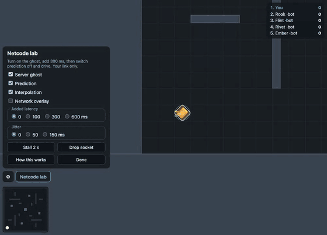

# Ricochet

A **real-time multiplayer tank arena in the browser, .io style** — open the link, type a name,
drive. Top-down and twin-stick: the hull goes where you steer, the turret where you aim, and every
shell bounces off a wall once. Node + TypeScript on the server, Phaser in the browser, one WebSocket
carrying a binary protocol.

**▶ The live demo's address lands with its first deploy** — on a desktop, a phone or with a
gamepad; bots fill every room, so you are never alone. Free hosting: the first visit after a quiet
spell takes about a minute to wake the server, and every wake is a fresh arena
([ADR-0004](docs/adr/ADR-0004-demo-host.md)). Until then, `docker run` below is the same image.



_Recorded against the built server and page with the lab on: the ghost switched on, the overlay
open, 300 ms added to the round trip — the own tank still turning and firing on the frame of the
key, the ghost trailing it by the round trip — then a death, and the replay of the shell that did
it, off its wall._

## Try to break it

1. **Drive.** WASD or the arrows, the mouse to aim, click or Space to fire — or two thumb sticks on
   a phone, or a gamepad. Bank a shot off a wall.
2. **Open the lab** (_Netcode lab_, bottom left) and tick **Server ghost**: an outline of where the
   server last had every tank. Over yours it trails behind — your tank is ahead of the server by a
   round trip; over the others it leads — they are drawn a little in the past. Tick **Network
   overlay** for the numbers and their last ten seconds.
3. **Add 300 ms**, then 600, and jitter. Your tank still answers on the next frame; the ghost falls
   further behind; the overlay's _predict_ line shows the inputs in flight.
4. **Switch Prediction off** and drive. Now every key waits for the server — a round trip and the
   interpolation delay, about 400 ms at 300. Switch it back on.
5. **Stall 2 s** and **Drop socket.** The others freeze and catch up without a jump; a dropped
   socket comes back on the same tank in a quarter of a second.
6. **Die.** The replay shows the last three seconds from the server's snapshots, and traces the
   shell that killed you off its wall.

The lab breaks only your own link, on the server's side of your socket — nobody else in the room
feels it. The E2E suite does all of this as a stranger would, against the live demo too
(`E2E_BASE_URL=… pnpm e2e:live`) — in under 4 seconds against a local server.

## What makes it interesting to build

Not the tanks. The 150 milliseconds between your thumb and the server. The other three projects in
this workspace synchronise _outcomes_; here every player **steers**, and every input fights the
latency. Five decisions carry it.

**The server is the only authority**
([ADR-0001](docs/adr/ADR-0001-server-authority-and-prediction.md)). It steps one world at 30 Hz
from everyone's inputs and sends each client a snapshot of what that client may see. A client
sends a direction to drive, a direction to aim, a trigger and a sequence number — never a position,
a hit or a score. Anything the server would have to believe is a cheat waiting to be sent.

**Your own tank is predicted** (ADR-0001). The browser runs the server's own simulation on your
inputs the moment you press, keeps those the server has not acknowledged, and when a snapshot
arrives rewinds to the server's tank and replays them. It can be exact because the simulation is
integers and correctly rounded arithmetic — no `Math.sin`, enforced by lint — so Node, V8,
SpiderMonkey and JavaScriptCore compute the same bits; a correction on screen means the server
really disagreed, and it is eased away rather than snapped. Over ten simulated minutes at
150 ± 40 ms the prediction matched the server to the bit in all 17,750 ticks no other tank touched.

**Everyone else is interpolated** between two snapshots that both exist, about 100 ms in the past,
behind a delay that adapts to the 95th percentile of your link's jitter. Nothing is extrapolated
further than one tick, so a tank never runs on through a wall it was about to turn at.

**Shells are fast-forwarded, not targets rewound**
([ADR-0002](docs/adr/ADR-0002-shells-fast-forwarded.md)). Your shell is drawn the frame you fire.
On the server it starts moved forward by your half round trip and the time your input waited in its
queue, capped at 100 ms — where your screen drew it, in the server's present. Hits are decided only
there, and shown only from the server's events: in ten minutes against bots, 649 hits drawn and
every one the server's.

**The wire is bytes** ([ADR-0003](docs/adr/ADR-0003-websocket.md),
[`docs/protocol.md`](docs/protocol.md)). Positions in eighths of a unit, aims in 1,024ths of a
turn; snapshots as deltas against the last one sent on that socket; a shell sent once, as a
starting condition your browser flies on with the same simulation; and only what lies within your
view — a wallhack has nothing to read.

How the pieces fit — one tick on the server, one frame on the client, an input's life from the key
to its acknowledgement: [`docs/architecture.md`](docs/architecture.md).

## How it is held to account

| What | Measured | Where |
| --- | --- | --- |
| The server's tick | 12 tanks: **0.11 ms** at p99 · 24 tanks: 0.35 ms — the period is 33 ms | [`docs/bench/`](docs/bench/README.md) |
| Bandwidth | **1.75 KB/s** down to the busiest of 12 clients, against a 6 KB/s budget | [`docs/bench/`](docs/bench/README.md) |
| Load | **240 players** in 20 rooms for 30 minutes, half on a broken link: the tick 1.06 ms late and 3.5 ms of work at p99; 400 of 400 short drops back on their own tank | [`docs/load/`](docs/load/README.md) |
| The browser | a phone profile, CPU throttled 4×: 12 tanks and 36 shells at the display's rate, 2 ms of work a frame at p99; ten minutes with a flat heap | [`docs/perf/`](docs/perf/README.md) |
| Feel | at 150 ms, a key and a press each drawn on the next frame, 20 of 20 | [`docs/perf/`](docs/perf/README.md) |
| Determinism | the simulation's pinned 5,000-tick run ends in the same hash in Chromium, Firefox and WebKit | `e2e/determinism.spec.ts` |

**E2E in CI** (Playwright): two players in one room see each other move, one shoots the other dead
and both see the kill, 300 ms on one leaves its tank answering on the next frame and its motion
smooth to the other, and a dropped socket resumes the same tank; a stranger's two minutes — bots,
the ghost, 300 ms, the prediction off and on, a drop — run against the local server and against
the Docker image Render deploys.

## Running it

```bash
pnpm install
pnpm dev        # the server (lab on) and the page on http://localhost:5173
pnpm check      # lint, build, typecheck, every test — what CI runs
pnpm e2e        # the engines and the game in a browser (needs `pnpm exec playwright install`)
```

`docker build -t ricochet . && docker run -p 8080:8080 -e RICOCHET_LAB=on ricochet` runs the image
the demo runs, on http://localhost:8080. `pnpm bench`, `pnpm load` and the browser probes are
described in [`CLAUDE.md`](CLAUDE.md).

## Documents

| File | What it is |
| --- | --- |
| [`CLAUDE.md`](CLAUDE.md) | The canon — packages, rules, commands. Kept current as code lands. |
| [`ROADMAP.md`](ROADMAP.md) | The task map — blocks, gates, `Done when`, and what each measured. |
| [`docs/protocol.md`](docs/protocol.md) | The wire contract — every message's bytes, the units, the rules. |
| [`docs/architecture.md`](docs/architecture.md) | One tick, one frame, an input's life — as diagrams. |
| [`docs/adr/`](docs/adr) | The decisions everything else is downstream of. |

No money of any kind — this is not a casino game.
