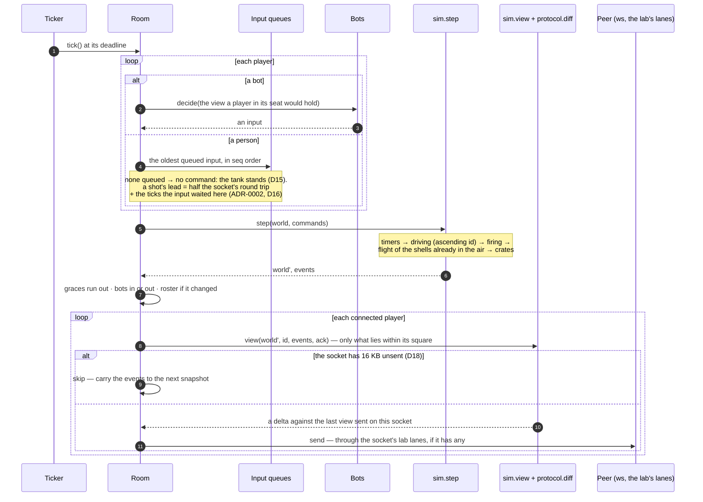
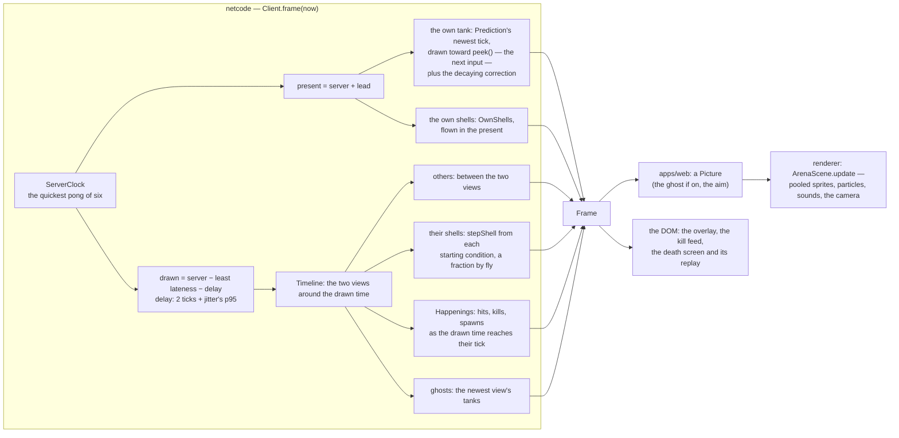

# Architecture

Three pictures of one system: **one tick on the server**, thirty times a second; **one frame on the
client**, at the display's rate; and **an input's life**, from the key to the snapshot that
acknowledges it. The why behind each is in the ADRs —
[0001](adr/ADR-0001-server-authority-and-prediction.md) (who decides, who predicts),
[0002](adr/ADR-0002-shells-fast-forwarded.md) (where a shell starts),
[0003](adr/ADR-0003-websocket.md) (the transport) and [0004](adr/ADR-0004-demo-host.md) (the host);
the bytes are [`protocol.md`](protocol.md).

```
packages/  geom · protocol · sim · bots          ← pure: no clock, no I/O; geom and sim exact
           netcode · renderer                    ← the client: the wire and the prediction; the stage
apps/      server (Fastify + ws) · web (Vite, Phaser, DOM)
tools/     bench (the tick, headless) · load (240 players, over the wire)
```

## 1. One tick on the server

`Ticker` runs every room's tick from one drift-free loop: deadlines from the first tick,
`start + n · period`, a sleep to just short of each and a spin for the rest.



- **The world is integers**, quantised to the wire's resolution at the end of every tick, so a
  client that steps the same inputs from a snapshot computes the server's own next state.
- **Each player costs a view, a diff and an encode**: a 12-tank tick is 0.11 ms of work at p99
  ([`bench/`](bench/README.md)); 240 players in 20 rooms, 3.5 ms ([`load/`](load/README.md)).
- **Nothing a client sends is believed but an input**: a direction to drive, a direction to aim, a
  trigger, and a `seq`. Hits are decided here, at the server's present, and only here.

## 2. One frame on the client

Phaser asks for a picture once per display frame; ticks never drive frames. `netcode` answers with
`frame(now)`, built from three clocks: the **present** (the server's clock plus the own lead), where
the own tank and its shells are; the **drawn time** (the server's clock less the interpolation
delay), where everyone else is; and **now**, for what is left of a correction.



- **Two times on one screen**, on purpose: the own tank is ahead of the server by the lead, the
  others behind it by the delay. The ghost draws both gaps — over the own tank, where the server
  last had it; over the others, where the newest snapshot has them.
- **Nothing is inferred.** A hit is an event from the server; a shell's end on a wall is its own
  flight, which is the server's to the bit; a shell that vanished near a tank shows nothing until
  the server says why.
- **The renderer knows no protocol.** It is handed eighths and 1,024ths and draws them; the arena
  can be tested without a server and re-skinned without touching the game.

## 3. An input's life

A player presses **D**, the server 150 ms away.

```mermaid
sequenceDiagram
  autonumber
  participant K as Keyboard (apps/web)
  participant C as netcode Client
  participant Pr as Prediction
  participant S as Server (Room)
  participant Sc as Snapshot

  K->>C: keydown — held from now on
  C->>C: the next display frame: peek() — the intent now,<br/>consuming nothing
  C->>Pr: next(intent) → the tank one tick on
  Note over C: frame 1: the own tank is drawn moving toward it
  C->>C: the client's tick: the server's clock + the lead
  C->>Pr: push({seq: 41, aim, move, fire}) — stepTank, kept unacknowledged
  C->>S: input {seq 41} — 9 bytes
  Note over S: ~75 ms later: queued; the next tick applies it,<br/>one a tick in seq order
  S->>Sc: the tick's view, ack = 41
  Sc->>C: ~75 ms later
  C->>Pr: reconcile(the server's tank, ack 41)
  Note over Pr: drop 1…41 · set the tank to the server's ·<br/>replay 42… through stepTank · moved = how far<br/>the drawing jumped (0 when nobody else touched it)
  Pr-->>C: a correction, if any — an offset decaying over ~100 ms
  Note over C: a respawn is drawn at once; a late input costs nothing:<br/>the server stood the tank that tick (D15), as predicted
```

- **The prediction is the server's own code** — `sim.stepTank` on the same quantised state — so in
  every tick no other tank touched it agrees to the bit: 17,750 of 17,750 over ten virtual minutes
  at 150 ± 40 ms (C0). A correction on screen means the server really disagreed, usually about
  another tank met on the way.
- **A press fires on its frame**, the same way: the shell the next input will carry is fired at
  once and flown in the present, adopted by the server's `shot` event under the same drawn id, or
  fizzled if the server refused it (C2).
- **A stalled link stops the inputs** once more are unacknowledged than a round trip and a full
  queue hold; the server stands the tank meanwhile, and the inputs resume from its present.
